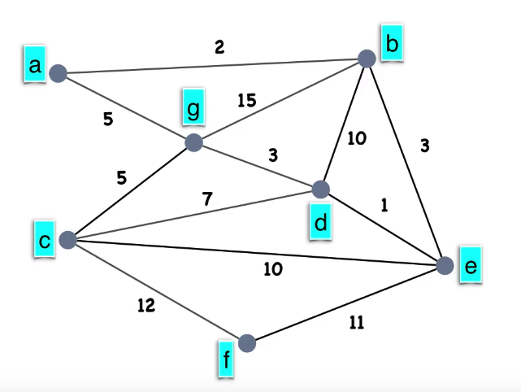

# Projet de Programmation Avancée

Construire un graphe modélisant la carte routière à partir
des villes que la commise voyageuse aura inscrites dans un ficher texte.
Ce graphe G = (S,A) a pour ensemble S de sommets les villes et pour
ensemble A d’arêtes les routes reliant ces villes.

## Exemple d'un graphe utilisé pour la Commise Voyageuse

